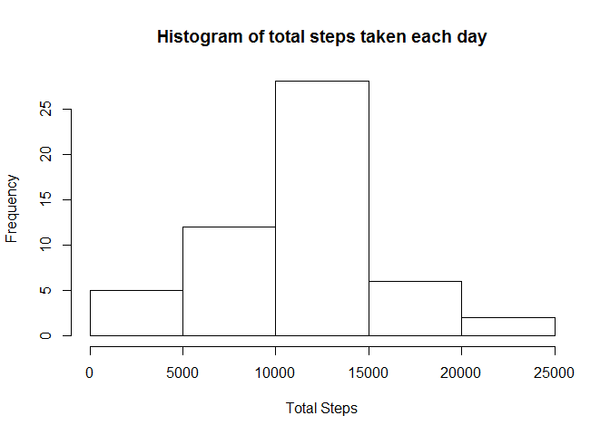
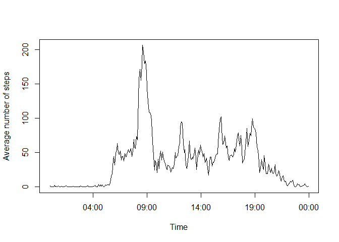
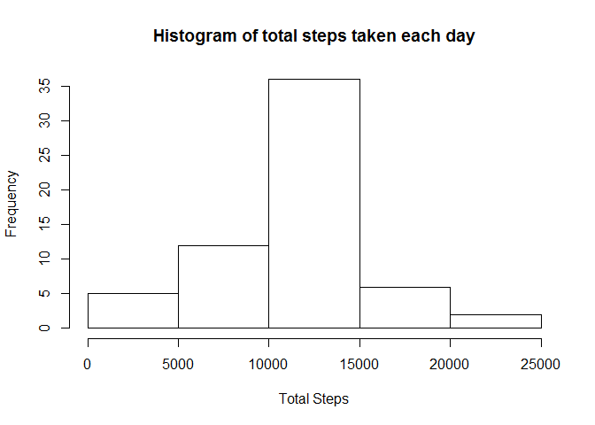
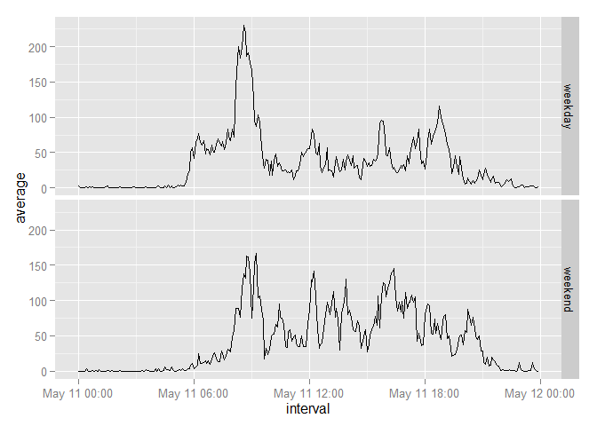

# Reproducible Research: Peer Assessment 1


## Loading and preprocessing the data
We first set the global options to make sure that the code can be evaluated by seeting echo = TRUE.  

```r
library(knitr)
# Set the global options
opts_chunk$set(echo=TRUE)
```
Then we unzip, load, and process the data.  

```r
# Unzip and load the data
unzip("activity.zip")
act <- read.csv("activity.csv")
head(act)
```

```
##   steps       date interval
## 1    NA 2012-10-01        0
## 2    NA 2012-10-01        5
## 3    NA 2012-10-01       10
## 4    NA 2012-10-01       15
## 5    NA 2012-10-01       20
## 6    NA 2012-10-01       25
```


## What is mean total number of steps taken per day?
This part of the assignment consists of three steps.  
1. The total number of steps taken per day are summarized in a table.  

```r
library(plyr)
# Remove the missing values in the dataset
actnarm <- act[complete.cases(act),]
# Summarize the total number of steps taken per day
totalsteps <- ddply(actnarm, .(date), summarize, total=sum(steps))
print(totalsteps)
```

```
##          date total
## 1  2012-10-02   126
## 2  2012-10-03 11352
## 3  2012-10-04 12116
## 4  2012-10-05 13294
## 5  2012-10-06 15420
## 6  2012-10-07 11015
## 7  2012-10-09 12811
## 8  2012-10-10  9900
## 9  2012-10-11 10304
## 10 2012-10-12 17382
## 11 2012-10-13 12426
## 12 2012-10-14 15098
## 13 2012-10-15 10139
## 14 2012-10-16 15084
## 15 2012-10-17 13452
## 16 2012-10-18 10056
## 17 2012-10-19 11829
## 18 2012-10-20 10395
## 19 2012-10-21  8821
## 20 2012-10-22 13460
## 21 2012-10-23  8918
## 22 2012-10-24  8355
## 23 2012-10-25  2492
## 24 2012-10-26  6778
## 25 2012-10-27 10119
## 26 2012-10-28 11458
## 27 2012-10-29  5018
## 28 2012-10-30  9819
## 29 2012-10-31 15414
## 30 2012-11-02 10600
## 31 2012-11-03 10571
## 32 2012-11-05 10439
## 33 2012-11-06  8334
## 34 2012-11-07 12883
## 35 2012-11-08  3219
## 36 2012-11-11 12608
## 37 2012-11-12 10765
## 38 2012-11-13  7336
## 39 2012-11-15    41
## 40 2012-11-16  5441
## 41 2012-11-17 14339
## 42 2012-11-18 15110
## 43 2012-11-19  8841
## 44 2012-11-20  4472
## 45 2012-11-21 12787
## 46 2012-11-22 20427
## 47 2012-11-23 21194
## 48 2012-11-24 14478
## 49 2012-11-25 11834
## 50 2012-11-26 11162
## 51 2012-11-27 13646
## 52 2012-11-28 10183
## 53 2012-11-29  7047
```

2. A histogram of the total number of steps taken each day is shown.  

```r
hist(totalsteps$total,main="Histogram of total steps taken each day",xlab="Total Steps")
```

 

3. Calculate and report the mean and median of the total number of steps taken per day.  

```r
# Calculate the mean and median
meansteps <- as.integer(round(sum(totalsteps$total)/length(totalsteps$total)))
mediansteps <- median(totalsteps$total)
```
The mean number of steps taken per day is 10766 and the median number of steps taken per day is 10765.  


## What is the average daily activity pattern?
This part of the assignment consists of two steps.  
1. We first calculate the average number of steps taken across all days using ddply() function. Secondly, we convert the time interval to "time". At last, we make the time series plot.

```r
# Calculate the average number of steps taken across all days
daily <- ddply(actnarm, .(interval), summarize, average=mean(steps))
# Add leading "0" the 5-minute intnerval and convert to POSIXlt
library(stringr)
daily$interval <- str_pad(daily$interval,4,pad="0")
daily$interval <-strptime(daily$interval,"%H%M")
# Make the time series plot
plot(daily$interval,daily$average,type="l",xlab="Time",ylab="Average number of steps")
```

 

2. To find out the 5-minute interval with maximum number of steps, we need to order the dataset by average steps.

```r
# Reorder the dataset and find out the 5-minute interval with maximum number of # steps
orderdf <- daily[order(daily$average,decreasing=TRUE),]
orderdf$interval <- gsub("2015-05-11 ","",orderdf$interval)
maxtime <- orderdf[1,1]
```
Therefore, the 5-minute interval with maximum number of steps is 08:35:00.


## Imputing missing values
1. To calculate the total number of rows with NAs, we use complete.cases() function.

```r
# Count the total number of rows with missing values
nacount <- sum(!complete.cases(act))
```
Therefore, the total number of missing values in the dataset is 2304.

2. To fill in all of the missing values, we decide to use the mean for that 5-minute interval.

```r
# Extract the rows with missing values
actna <- act[!complete.cases(act),]
# Fill in all of the missing values using the mean for that 5-minute interval
actna$steps <- rep(daily$average, length(unique(actna$date)))
head(actna)
```

```
##       steps       date interval
## 1 1.7169811 2012-10-01        0
## 2 0.3396226 2012-10-01        5
## 3 0.1320755 2012-10-01       10
## 4 0.1509434 2012-10-01       15
## 5 0.0754717 2012-10-01       20
## 6 2.0943396 2012-10-01       25
```

3. Create the new dataset with the missing data filled in.

```r
# Combine the two sets of data
act.new <- rbind(actna,actnarm)
# Change the order of the dataset
act.new <- act.new[order(act.new$date,act.new$interval),]
```

4. Summarize the total number of steps taken each day. The histogram of is shown as below.

```r
total.new <- ddply(act.new, .(date), summarize, total=sum(steps))
mean.new <- as.integer(round(sum(total.new$total)/length(total.new$total)))
median.new <- as.integer(round(median(total.new$total)))
hist(total.new$total,main="Histogram of total steps taken each day",xlab="Total Steps")  
```

 

The mean number of steps taken per day is 10766 and the median number of steps taken per day is 10766. The mean value does not differ from the estimate from the first part of the assignment. However, imputing missing data changes the median value (from 10765 to 10766) slightly.

## Are there differences in activity patterns between weekdays and weekends?
1. We combine date and interval, convert to POSIXlt time series, extract the weekdays information, and add the labels.

```r
library(stringr)
act.new$interval <- str_pad(act.new$interval,4,pad="0")
act.new$time <- paste(act.new$date,act.new$interval)
act.new$time <-strptime(act.new$time,"%Y-%m-%d %H%M")
act.new$day <- weekdays(act.new$time)
act.new$label <- ifelse(act.new$day %in% c("Saturday","Sunday"), "weekend","weekday")
head(act.new)
```

```
##       steps       date interval                time    day   label
## 1 1.7169811 2012-10-01     0000 2012-10-01 00:00:00 Monday weekday
## 2 0.3396226 2012-10-01     0005 2012-10-01 00:05:00 Monday weekday
## 3 0.1320755 2012-10-01     0010 2012-10-01 00:10:00 Monday weekday
## 4 0.1509434 2012-10-01     0015 2012-10-01 00:15:00 Monday weekday
## 5 0.0754717 2012-10-01     0020 2012-10-01 00:20:00 Monday weekday
## 6 2.0943396 2012-10-01     0025 2012-10-01 00:25:00 Monday weekday
```

2. Make a panel plot containing a time series plot of the 5-minute interval (x-axis) and the average number of steps taken, averaged across all weekday days or weekend days (y-axis) to compare activity patterns between weekdays and weekends.

```r
daily.new <- ddply(act.new, .(interval,label), summarize, average=mean(steps))
# Add leading "0" the 5-minute intnerval and convert to POSIXlt
library(stringr)
daily.new$interval <- str_pad(daily.new$interval,4,pad="0")
daily.new$interval <-strptime(daily.new$interval,"%H%M")
# Make the time series plot
library(ggplot2)
p <- ggplot(daily.new,aes(x=interval,y=average))
p + geom_line() + facet_grid(label~.) 
```

 
